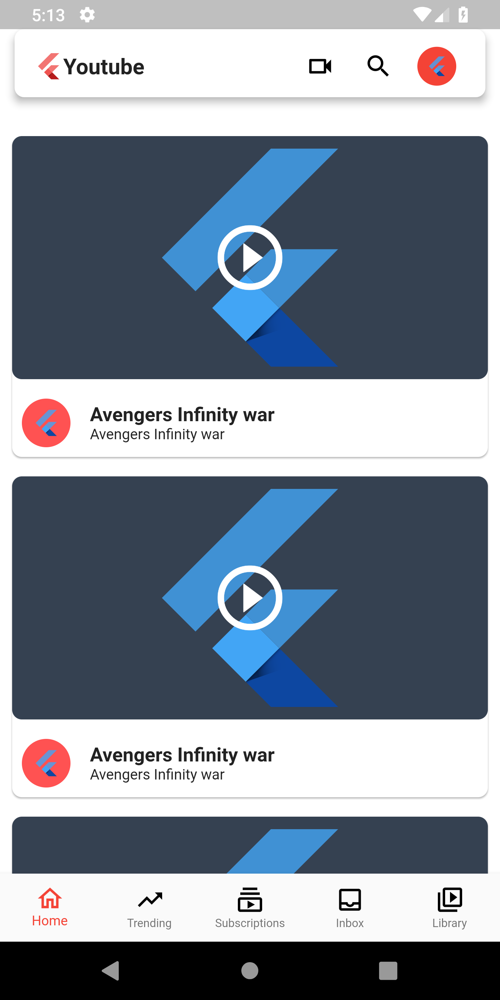
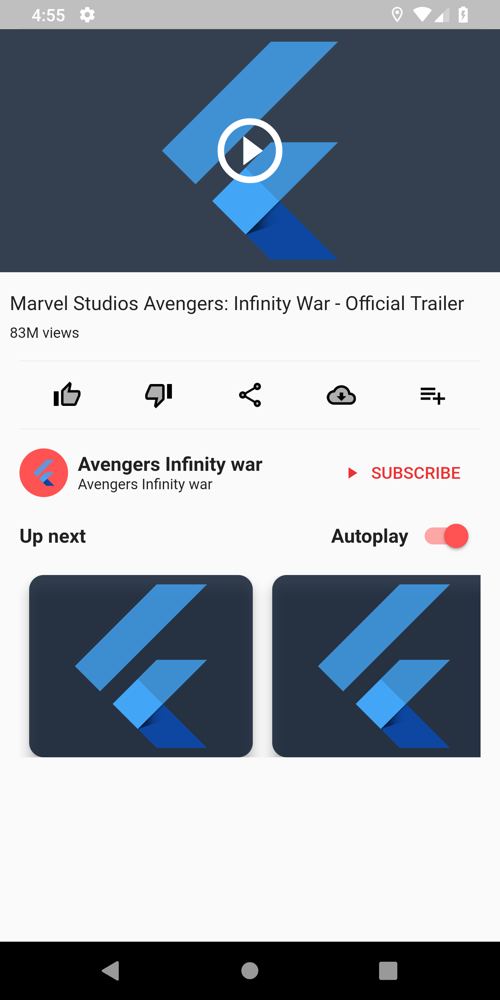
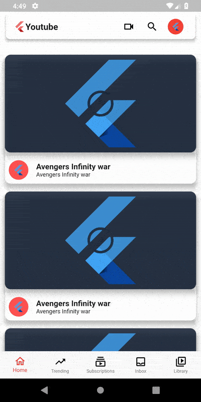
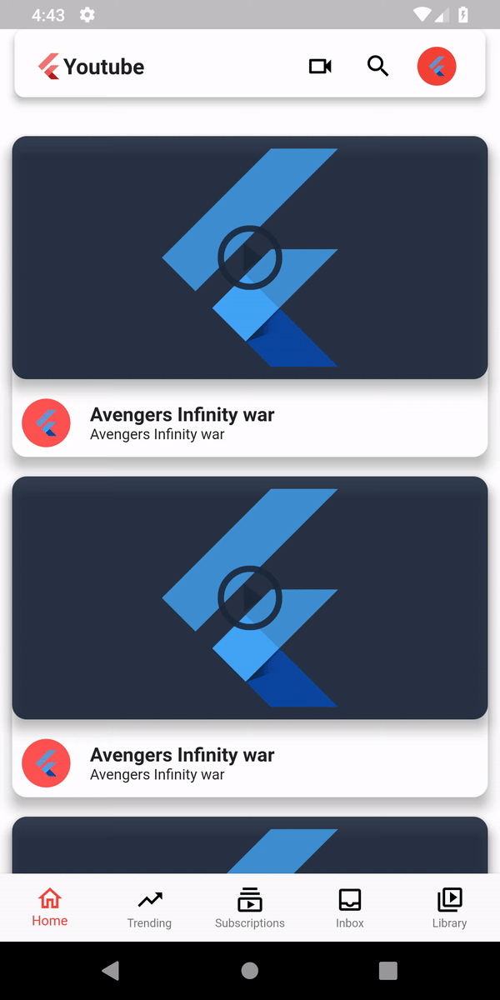

# Flutter Youtube App Redesign

Youtube App Redesign in flutter, contains the animation of the Picture in picture mode animation and Floating app bar.

## Preview

| Home | Video detail |
| ------------------ | ------------------ |
|   |  |

| Floating Appbar | PIP Animation |
| ------------------ | ------------------ | 
|  |  |

## Getting Started

For help getting started with Flutter, view online
[documentation](https://flutter.io/).

## Questions?🤔

Hit me on twitter 

## Pull Requests

I welcome and encourage all pull requests. Here are some basic rules to follow to ensure timely addition of your request:

  1. Match coding style (braces, spacing, etc.) This is best achieved using `Reformat Code` feature of Android Studio `CMD`+`Option`+`L` on Mac and `CTRL` + `ALT` + `L` on Linux + Windows .
  2. If its a feature, bugfix, or anything please only change code to what you specify.
  3. Please keep PR titles easy to read and descriptive of changes, this will make them easier to merge :)
  4. Check for existing [issues](https://github.com/ibhavikmakwana/youtube_flutter_app/issues) first, before filing an issue.

## Donate

> If you found this project helpful or you learned something from the source code and want to thank me, consider buying me a cup of :coffee:
>
> - [PayPal](https://www.paypal.me/ibhavikmakwana)

## License

Copyright 2018 Bhavik Makwana

Licensed under the Apache License, Version 2.0 (the "License"); you may not use this file except in compliance with the License. You may obtain a copy of the License at

http://www.apache.org/licenses/LICENSE-2.0

Unless required by applicable law or agreed to in writing, software distributed under the License is distributed on an "AS IS" BASIS, WITHOUT WARRANTIES OR CONDITIONS OF ANY KIND, either express or implied. See the License for the specific language governing permissions and limitations under the License.
